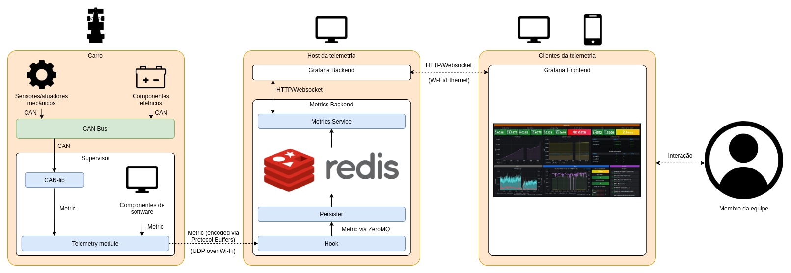

Our telemetry's architecture is divided in two main components: metric backend and Grafana.

_An overview of the architecture_

# Metrics backend
This component is responsible for ingesting, storing and serving metrics. It is divided into four services:
- **Hook**: receives metrics from the car and enqueues them into a ZeroMQ queue.
- **Persister**: consumes from Hook's queue, performs some validation and  then persists metrics onto redis.
- **Redis**: an in memory key-value store that acts as our primary database. [Learn more](https://redis.io/).
- **Metrics service**: provides an interface for accessing metrics via HTTP or Websockets. This interface is used by Grafana.

Learn more about how the metrics backend works [here](./Backend).

# Grafana
This component is responsible for managing dashboards and other visualization tools used by the team's members. It consumes metrics from our backend.

Learn more about how Grafana works [here](./Grafana).

# Docker and Docker Compose
[Docker](https://docker.com) is a containerization tool that helps us manage releases and install our telemetry without worrying too much about dependencies. [Docker Compose](https://docs.docker.com/compose/) a tool that facilitates Docker deployments and development, making it easy to manage all of those mentioned services using a single command.

Learn more about how our telemetry uses Docker and Docker Compose [here](./Docker)